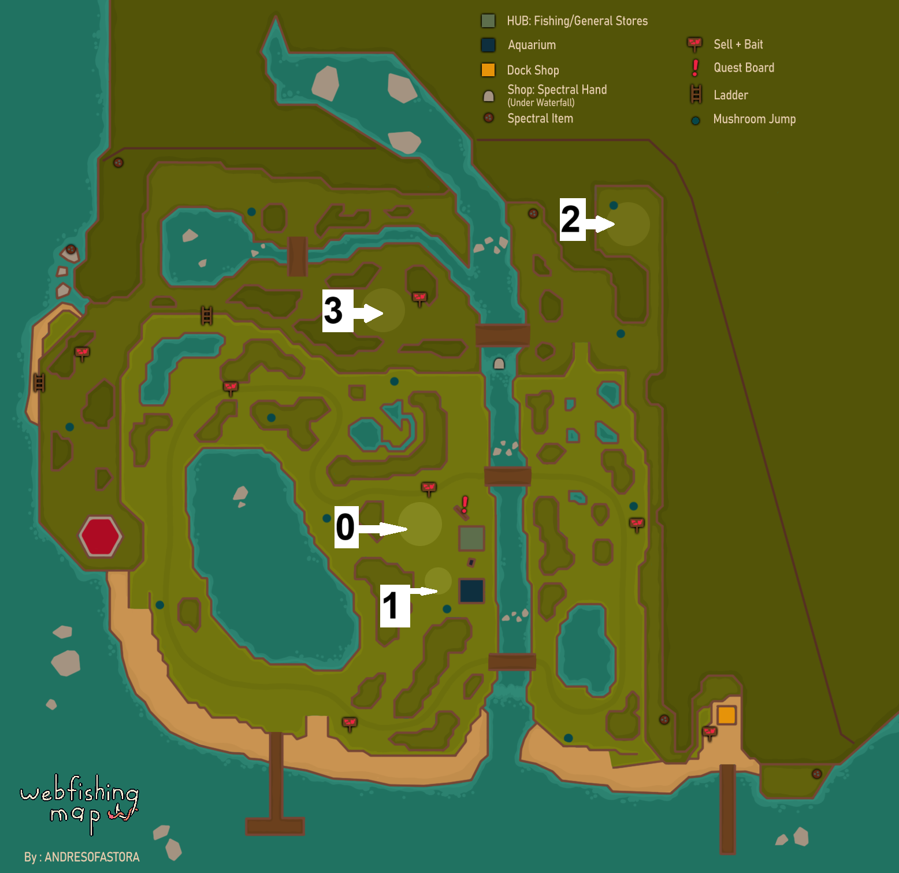

# Chalksave

Chat-based chalk canvas saver and loader, based on the wonderful GDWeave by NotNet.

# Basic usage
Usage:

/helpchalk - lists below commands

/listchalk - lists chalk saves in the save directory (see "Technical info - files" for more info)

/loadchalk \<filename> - loads specific file

/savechalk \<canvas ID> \<filename> - saves specified canvas with filename

  

# CANVAS ID MAP

If you wish to know the ID of a specific canvas, please refer to the below map.

  

# Technical info - files

Files are stored as json dicts at user://chalksaves/, usually found at AppData\Roaming\Godot\app_userdata\webfishing_2_newver\chalksaves depending on your layout.

Dict keys:
canvasID - the canvas ID, used for loading the file to the correct canvas
canvasArr - Array of 3 dimensional arrays. Each array is split into Canvas x coord, y coord and colour.
